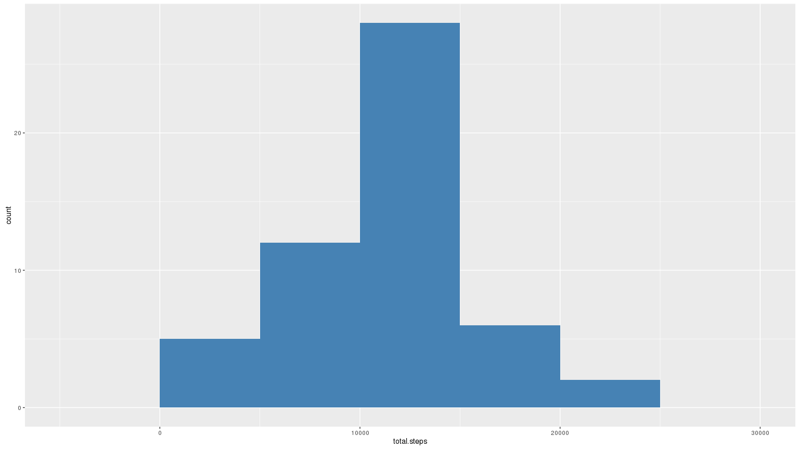
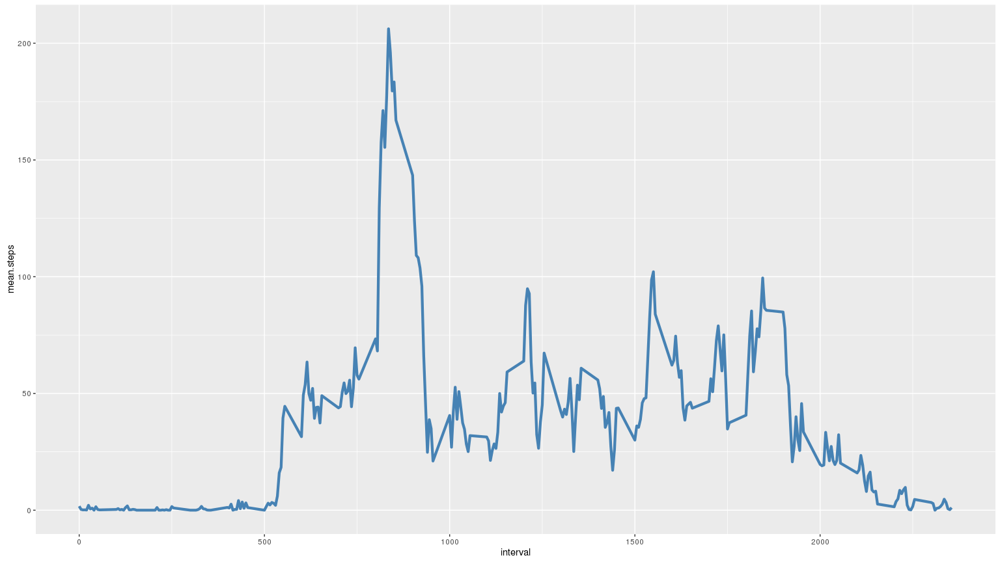
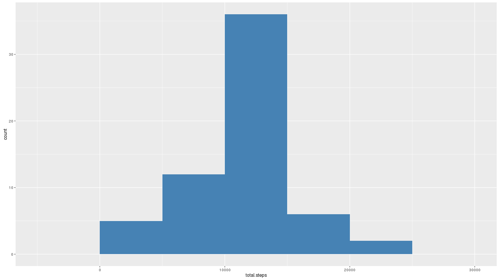
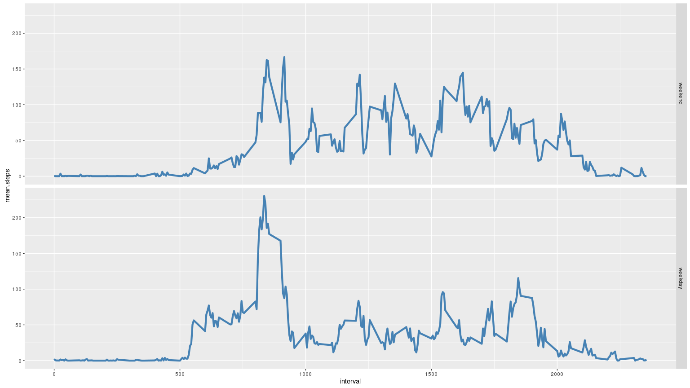

# Reproducible Research: Peer Assessment 1

## Loading and preprocessing the data

Load needed packages.

```r
library(data.table)
library(dplyr)
library(ggplot2)
```

Read zip file and convert dates.

```r
data <- data.table(read.csv(unz("activity.zip", "activity.csv")))
data <- mutate(data, date = as.Date(date))
```

## What is mean total number of steps taken per day?

Histogram of the total number of steps taken each day.

```r
days.summary <- data %>% 
           na.omit() %>% 
           group_by(date) %>% 
           summarise(total.steps = sum(steps))
ggplot(days.summary, aes(total.steps)) + 
    geom_histogram(binwidth = 5000, fill = "steelblue")
```

 

Calculate mean and median of steps per day.

```r
print(mean.total.steps <- mean(days.summary$total.steps))
```

```
## [1] 10766.19
```

```r
print(median.total.steps <- median(days.summary$total.steps))
```

```
## [1] 10765
```

## What is the average daily activity pattern?

Time series plot of the 5-minute interval (x-axis) and the average number of steps taken, averaged across all days (y-axis).

```r
interval.summary <- data %>% 
           na.omit() %>% 
           group_by(interval) %>% 
           summarise(mean.steps = mean(steps))
ggplot(interval.summary, aes(interval, mean.steps)) + 
    geom_line(size = 1.5, color = "steelblue") 
```

 

Which 5-minute interval, on average across all the days in the dataset,
contains the maximum number of steps?

```r
interval.summary[which.max(interval.summary$mean.steps)]
```

```
## Source: local data table [1 x 2]
## 
##   interval mean.steps
##      (int)      (dbl)
## 1      835   206.1698
```

## Imputing missing values

Check for missing values.

```r
col.na <- colSums(is.na(data))
print(col.na)
```

```
##    steps     date interval 
##     2304        0        0
```

```r
steps.missing <- col.na['steps']
days.summary <- data %>% 
    filter(is.na(steps)) %>% 
    group_by(date) %>% 
    summarise(total.intervals = n(), missing.intervals = sum(is.na(steps)))
print(days.summary)
```

```
## Source: local data table [8 x 3]
## 
##         date total.intervals missing.intervals
##       (date)           (int)             (int)
## 1 2012-10-01             288               288
## 2 2012-10-08             288               288
## 3 2012-11-01             288               288
## 4 2012-11-04             288               288
## 5 2012-11-09             288               288
## 6 2012-11-10             288               288
## 7 2012-11-14             288               288
## 8 2012-11-30             288               288
```

```r
days.missing <- nrow(days.summary)
stopifnot(identical(days.summary$total.intervals,
                    days.summary$missing.intervals))
```

There are total of 8 days with all intervals missing (2304 intervals overall). Lets impute each missing interval with it's mean value across all days.

```r
data.imputed <- data %>% left_join(interval.summary, "interval") %>%
    mutate(steps = replace(steps, is.na(steps), mean.steps[is.na(steps)])) %>%
    select(-mean.steps)
stopifnot(sum(is.na(data.imputed)) == 0)
```

How imputing affected mean and median of steps per day? 

```r
days.summary <- data.imputed %>% 
           group_by(date) %>% 
           summarise(total.steps = sum(steps))
print(mean.total.steps.imputed <- mean(days.summary$total.steps))
```

```
## [1] 10766.19
```

```r
print(median.total.steps.imputed <- median(days.summary$total.steps))
```

```
## [1] 10766.19
```

```r
paste("Mean changed by ", mean.total.steps.imputed - mean.total.steps, 
      sep = "")
```

```
## [1] "Mean changed by 0"
```

```r
paste("Median changed by ", median.total.steps.imputed - median.total.steps, 
      sep = "")
```

```
## [1] "Median changed by 1.1886792452824"
```

Histogram of the total number of steps taken each day for imputed dataset.

```r
ggplot(days.summary, aes(total.steps)) + 
    geom_histogram(binwidth = 5000, fill = "steelblue")
```

 

## Are there differences in activity patterns between weekdays and weekends?

Time series plot of the 5-minute interval (x-axis) and the average number of steps taken, averaged across weekdays and weekends separately (y-axis).

```r
weekends <- c("Saturday", "Sunday")
weekday.type.interval.summary <- data.imputed %>% 
    mutate(weekday.type = factor(weekdays(date) %in% weekends, 
                                 levels = c(T, F),
                                 labels = c("weekend", "weekday"))) %>%
    group_by(interval, weekday.type) %>%
    summarise(mean.steps = mean(steps))
    
ggplot(weekday.type.interval.summary, aes(interval, mean.steps)) +
    facet_grid(weekday.type~.) +
    geom_line(size = 1.5, color = "steelblue") 
```

 
